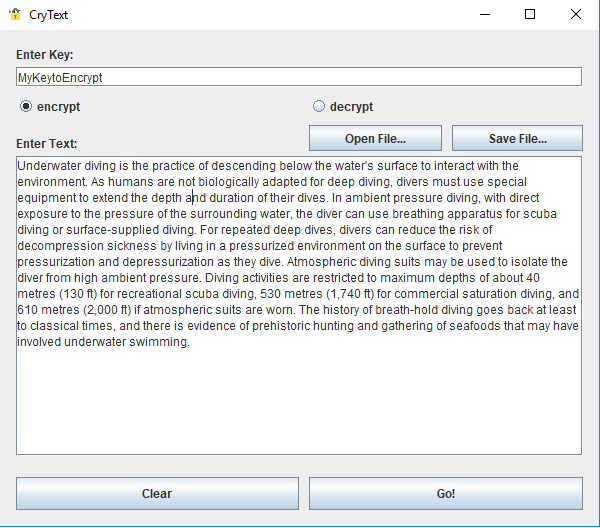
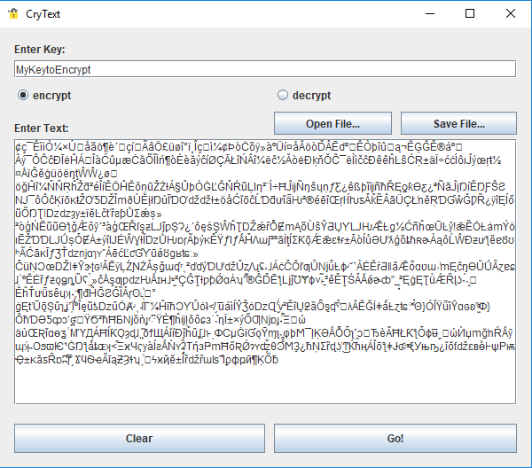

## About

#### CryText
It's texts encryption/decryption app in graphics mode, support text files.

#### Example

#### Encrypted


## How to use
- Double-Click on "crytext.jar"

  or

- java -jar /way to folder with jar file/crytext.jar

You can select some .txt file to encryption.

## Requirement
- jre 8

## Installation
If haven't jre, download
> http://www.oracle.com/technetwork/java/javase/downloads/jre8-downloads-2133155.html
- Download CryText
Git:
> git clone https://github.com/dovudo/DwScript <br />

or

Press button 'Clone or download' on this page

or

> wget https://github.com/dovudo/CryText/crytext.jar

### It supports
```
Windows
Linux
Mac
```
